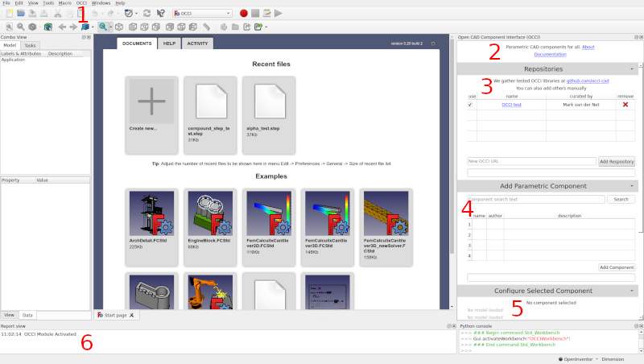

# freecad-plugin

A FreeCAD plugin that allows users to query customized parametric models from OCCI REST APIs.

[Preliminary Documentation](https://github.com/occi-cad/occi-freecad-plugin/blob/main/docs/index.md)

