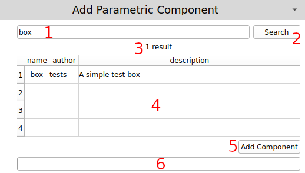

# Adding a Parametric Component

## Overview

A "Component" is a parametric CAD object that can be downloaded from an OCCI repository (server). This plugin provides a mechanism for searching for a component, configuring its parameters, and adding it to the active FreeCAD document. This section will only cover searching for a component and adding it to the document, not configuring its parameters. That is covered in [Configuring Parameters](configuring_parameters.md).

Each part of this section of the user interface is highlighted and explained below.

1. *Component search text* - This is the text of the component you would like to find. For instance, if you want a configurable bolt, type the text "bolt" here.
2. *Search* - Clicking this button will search all of the repositories with the `use` checkbox checked for the given model.
3. *Result* - This label will show the number of results after a search is initiated, or will display *Search error* if something went wrong. If this label shows *Search error*, check FreeCAD's *Report view* to see if there are any errors.
4. *Results table* - Shows the results of a search, including *name*, *author* and *description*. If there are no entries in this table it is because a search has not been initiated yet, there were no search results, or there was an error during the search. An entry in this table must be clicked before using the *Add Component* or *Update Component* buttons.
5. *Add Component* - Clicking this button will download the component and add it to the current active document. If there is no active document, the plugin will create one before adding the component to it. After clicking this button the progress bar (#6) will show how close to completing the request the plugin is.
8. *Progress bar* - Shows the progress while a component is being downloaded. This progress bar will start filling up once either the *Search* button (#2) or *Add Component* button (#5) has been clicked. This progress bar is also used when a component's parameters have been change and an update requested.

## Searching for a Component

1. Enter the desired search text in the *Component search text* field.
2. Click the *Search* button.
3. Wait for the progress bar to reach 100% and then be reset to being blank.
4. Verify that there were search results via the label (UI element #3 above), and any search results that were found are present in the results table (UI element #4 above).

## Adding a Component

1. Ensure that a component has been searched and found, and is displayed in the search results table (UI element #4 above).
2. Click on the component to add in the table. You can click any field in a row to highlight the whole row.
3. Click the *Add Component* button.
4. Wait for the progress bar to reach 100% and then be reset to being blank.
5. Verify that the component has been added to the active FreeCAD document.

## Troubleshooting

This plugin uses FreeCAD's *Report view* (click View->Panels->Report view) to report errors. If something does not work as expected, the first place to look is there. Fatal errors will be shown in red, warnings in yellow, and all other messages will be in black text.
