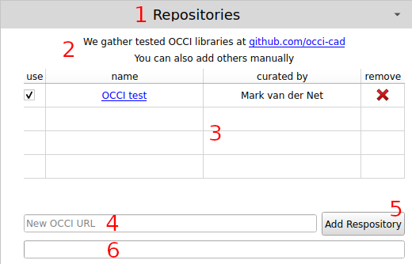

# Adding an OCCI Repository

## Overview

Repositories are servers that host collections of parametric CAD models. These repositories are used when doing a search for a specific component. Each main part of this section is highlighted and explained below.

1. *Repositories header* - Clicking this header will expand and collapse this section. It can be helpful to collapse this section once the list of repositories has been set.
2. *Information section* - Explains a little bit about this section of the UI, and provides a link to one of the main repositories.
3. *Repositories table* - Holds all of the default and added repositories. There is a `use` checkbox that sets whether or not this repository should be included in component searches. There is also a `remove` button that allows a repository to be removed from the table.
4. *New OCCI URL* - This text box allows the URL of a new OCCI repository to add. Duplicates are not allowed. Clicking button (#5) will pull information from this repository and add it to the table.
5. *Add Repository* - When clicked, this button will cause the repository information to be loaded from the server and added to the repositories table. Your computer must have an Internet connection for this to work.
6. *Progress Indicator* - Shows the progress while the new repository information is being downloaded and added to the tablet.

## Adding a New Repository

To add a new repository, enter the repository's server URL in the `New OCCI URL` text box (#4 above) and click the `Add Repository` button (#5 above). The progress indicator (#6 above) should progress to 100% and then go blank again. Once that happens the repository entry should be added to the table.

## Troubleshooting

This plugin uses FreeCAD's *Report view* (click View->Panels->Report view) to report errors. If something does not work as expected, the first place to look is there. Fatal errors will be shown in red, warnings in yellow, and all other messages will be in black text.
