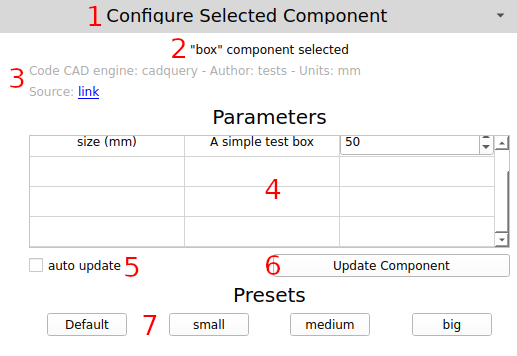

# Configuring Parameters

## Overview

The creator of a component model can define parameters that the end user can change. When a component has been searched and selected, these parameters will be loaded in the *Configure Selected Component* section. Each main part of this section is highlighted and explained below.

1. *Configure Selected Component header* - Clicking this will expand and collapse this section. This section is used frequently though, and probably does not need to be collapsed during normal use.
2. *component selected indicator* - The component that has been clicked on in the components table will be shown here. A component must be selected in order for its parameters and presets to be loaded.
3. *Metadata* - This area shows information related to the component, including what CAD engine created it, what the units are, and a link to download the model directly in a web browser.
4. *Parameters table* - Any parameters that the component creator defined for the component will be loaded into this table. The first column shows the name of the parameter with the measurement units in parentheses. The second column holds a description of the parameter. The last column will hold a control where the parameter can be changed. Only 2 types of parameters are currently supported: `number` and `text`. The `number` type can be either an integer or a float value. If the value has a decimal place in it, the plugin will assume it is a float.
5. *auto update checkbox* - If this box is checked, the component will be updated in the active FreeCAD document whenever a change is made to its parameters. This works fine for smaller models that load from the repository more quickly, but should usually not be checked for larger models that can take a long time to load. If this is not checked, the *Update Component* button (#6) has to be clicked to update the active component with the new parameters.
6. *Update Component button* - Clicking this button will request a new download of the component from the repository using the updated parameters. This loading process will use the progress bar from the *Add Parametric Component* section above this one.
7. *Presets* - A component author can define presets for a component. Presets are sets of values for the defined parameters. In the screenshot above there is a *Default* preset which sets the *size* value to 50mm. The plugin should always create a *Default* button for a parameter. The *small* button in the screenshot above will set the *size* value to 5mm. The other preset buttons will work in the same way. If the *auto update* checkbox is not checked, the *Update Component* button must be pressed after pressing a preset button to update the model.

## Update a Parameter

1. Change the value field for the corresponding parameter. In the screenshot above, there is a number field in the third column for the *size* parameter row.
2. Click the *Update Component* button.
3. Wait for the progress bar to reach 100% and then be reset to being blank.
4. Verify that the component has been added to the active FreeCAD document. If there is no active document, the plugin will create one and insert the component as if it were a new one.

## Using a Preset

1. Click on a preset button in the *Presets* section. In the screenshot above, an example would be the *large* button.
2. Verify that the parameter values have changed in the *Parameters* table.
3. If the *auto update* checkbox is not checked, click the *Update Component* button.
4. Wait for the progress bar in the *Add Parametric Component* to reach 100% and then be reset to being blank.
5. Verify that the component has changed appropriately in the active FreeCAD document.

## Troubleshooting

This plugin uses FreeCAD's *Report view* (click View->Panels->Report view) to report errors. If something does not work as expected, the first place to look is there. Fatal errors will be shown in red, warnings in yellow, and all other messages will be in black text.
