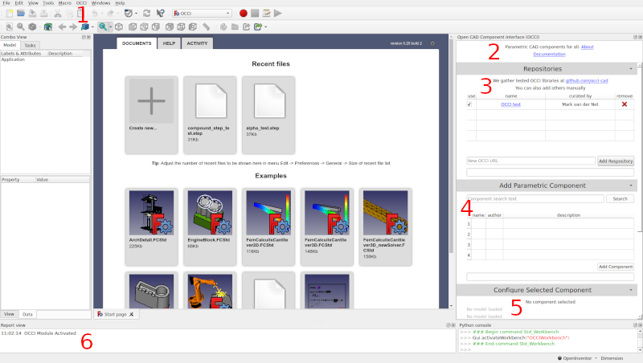

# UI Overview

This plugin adds a right side dock to the FreeCAD interface. The following screenshot shows the main sections of the plugin's user interface with a listing to explain each section afterward.

1. *OCCI menu* - This menu is added and only has one item: `Reset Repositories`. If you delete the default OCCI repository or have added repositories you do not want anymore, clicking this menu item will restore the repository listing to what it was the first time you launched the plugin.
2. *Informational section* - The very top of the dock holds a link to information about OCCI, and also holds a link to this documentation.
3. *Repositories* - This section can be collapsed to make more room for the others. This is a common practice after setting repositories since most of the work is done in sections 4 and 5. This is where new OCCI repositories are added. Whenever a component search is conducted, the repositories in this section are searched. It is very similar to the board manager in the Arduino IDE. This section of the UI will be covered in more detail in [Adding an OCCI Repository](adding_an_occi_repository.md).
4. *Add Parametric Component* - This section is collapsible, but is one of the areas that is frequently used, so it is common to leave it open. Users can search for components within the OCCI repositories and then click them to configure and add them to a FreeCAD document. This section of the UI will be covered in more detail in [Adding a Component](adding_a_component.md).
5. *Configure Selected Component* - This section is collapsible, but is one of the areas that is frequently used, so it is common to leave it open. Any parameters that the creator has set for a model will be displayed here. The parameters can be changed and then the component can be added to a FreeCAD document, or to update the existing component with the active FreeCAD document. This section of the UI will be covered in more detail in [Configuring Parameters](configuring_parameters.md).
6. *Report view* - This is part of the main FreeCAD interface, but will display messages from the OCCI plugin during operation. If the workbench does not work as expected, check this view to see if there is an error.
